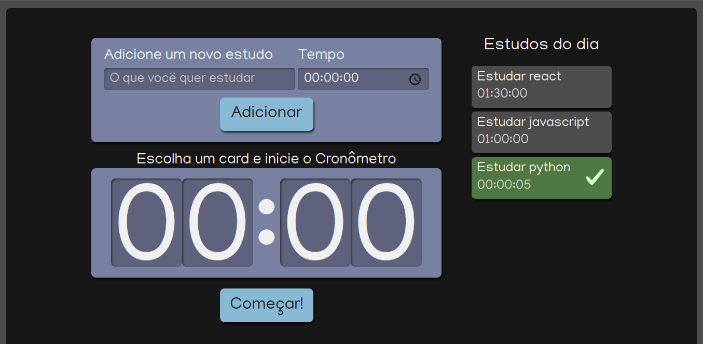

# Projeto do curso Fundamentos de React: escrevendo com Typescript

## Alura studies

In the project directory, you can run:

### `yarn start`

Runs the app in the development mode.\
Open [http://localhost:3000](http://localhost:3000) to view it in the browser.

